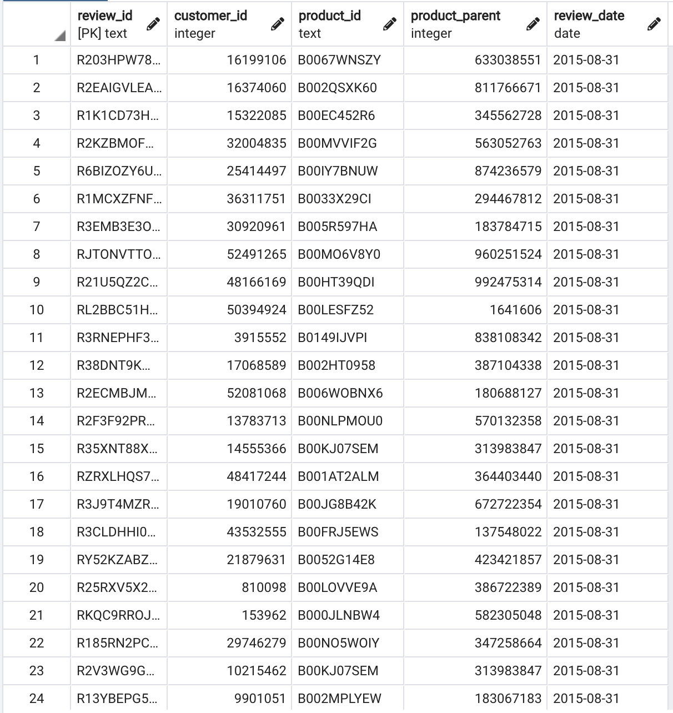
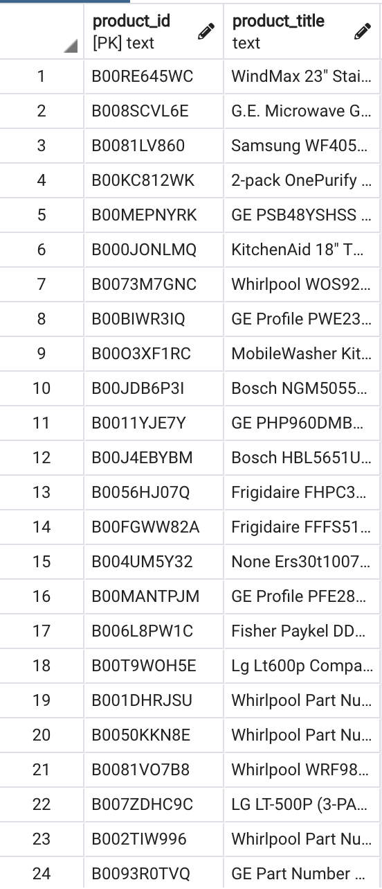
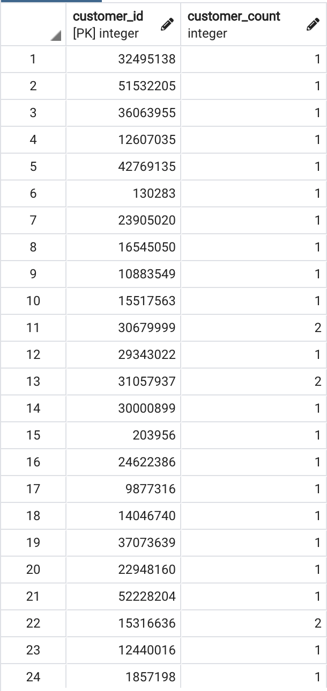
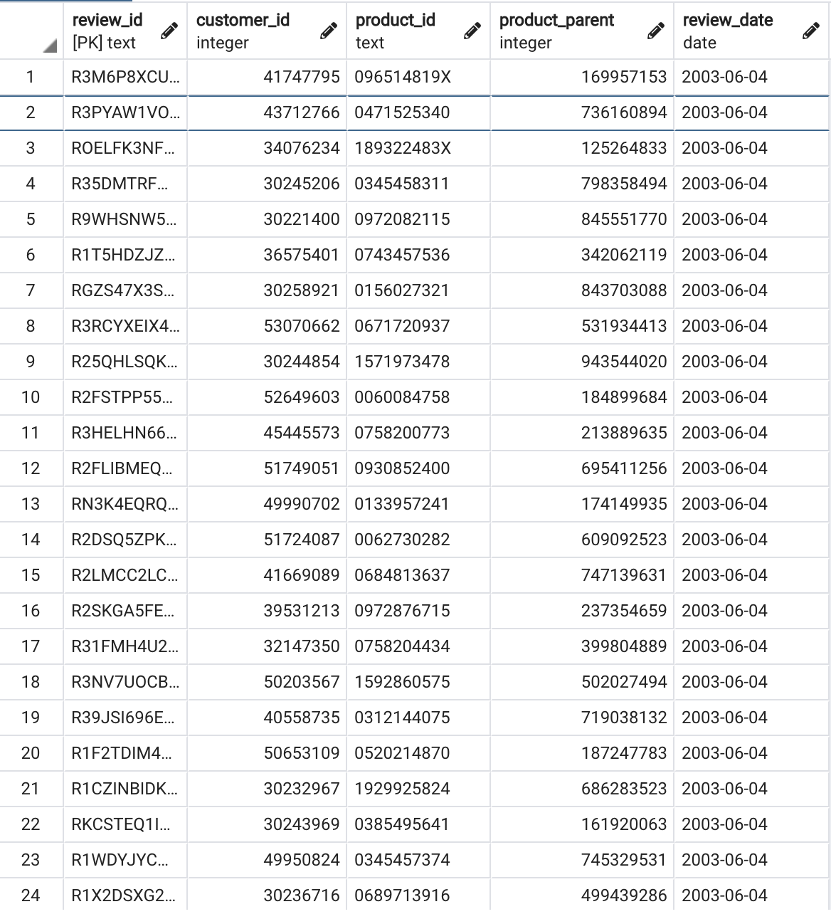
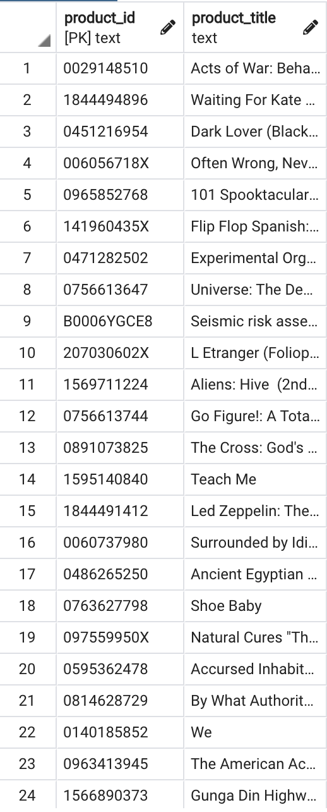
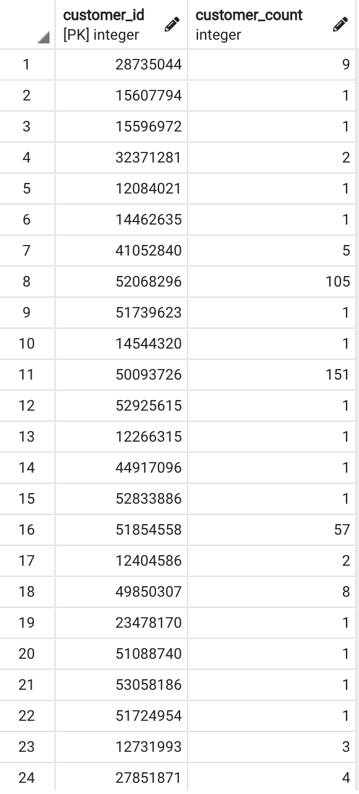

# big-data-challenge
**Big Data Homework:** This project focused on practicing the ETL (Extract, Transform, and Load) process in the cloud. Two Amazon Reviews datasets were selected from an AWS [resource](https://s3.amazonaws.com/amazon-reviews-pds/tsv/index.txt): Book reviews and Appliances reviews. The datasets were extracted, transformed to match SQL schemas, and loaded into an AWS RDS instance.

**level-1:**
- Big_Data_1.ipynb: ETL on Major Appliances reviews
- Big_Data_2.ipynb: ETL on Book reviews

- *images*: screenshots of SQL results
- *resources*: SQL schemas used to initialize the database & queries used to explore

## Major Appliance Reviews SQL Results:
### Reviews Table:

### Products Table:

### Customers Table:

## Book Reviews SQL Results:
### Reviews Table:

### Products Table:

### Customers Table:

### Extra Query Results on Number of Reviews for each Product:

